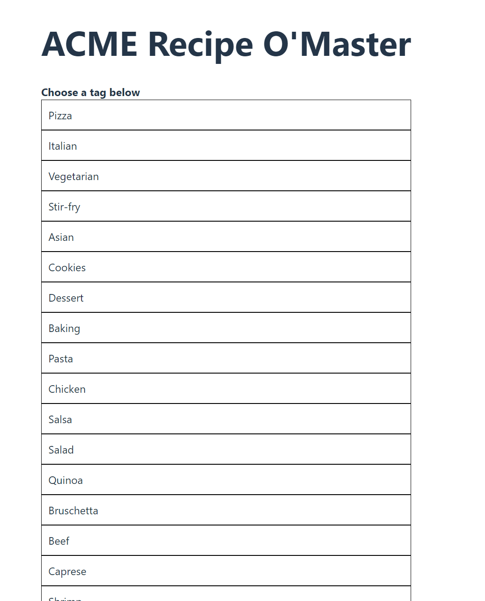
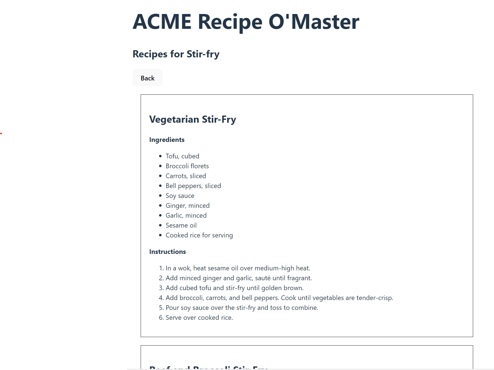

# Web Development Frameworks 2024 - Week Exercise 5

The goal of this exercise is to practice React useEffect data loading.

In this exercise you will create a food recipe application. The application works as follows:
- On start the application displays a list of recipe tags such as 'pasta', 'cookies' etc. The tag information is loaded from an API (https://dummyjson.com/recipes/tags)
- The user can click on a tag and the application will then hide the tag list and display a list of recipes matching the selected tag. The recipe information for the clicked tag is loaded from an API (https://dummyjson.com/recipes/tag/Pizza).
- User can also go back to the tag list. 
- Each receipe is displayed as box where recipe data such as ingredients and instructions are displayed

## Component Structure

There should be five components in the application:
* App 
* RecipeTagList
* RecipeTag
* RecipeList
* Recipe

## Example images
Here is how the application should look like when finished.
> 
> App rendering the RecipeTagList when the application starts


> 
> App renders RecipeList component when the user has clicked on a tag from the RecipeTagList

## Application functionality

In the application there are five react components:

- `App` is the root component that holds the logic of the application and controls the rendering output. App loads the data from the API. App renders directly RecipeTagList and RecipeList components. RecipeTagList is rendered when the application starts and RecipeList when the user has clicked a tag from RecipeTagList.
- `RecipeTagList` It renders the list of tags. Here is the type definition for the props of this component. :
  `interface IRecipeTagListProps {
    tagList: string[];
    onSelectTag: (tagName: string) => void;
  }`
  RecipeTagList should render the tags using RecipeTag component. 


- `RecipeTag` is the component that renders a single clickable tag. It is used by the `RecipeTagList` component. It should call the onSelectTag function received as prop when the tag is clicked and pass the name of the tag as a parameter to the function. The type definition for the props of this component is the following:
```
interface IRecipeTagProps {
    tagName: string;
    onSelectTag: (tagName: string) => void;
}
```


- `RecipeList` is the component that a list of recipes and it uses `Recipe` components to do so. The App component should deliver the correct recipes to render for this component as props. Here is the type definition of the props of this component: 
```
interface IRecipeListProps {
    recipes: IRecipe[];
}
```

- `Recipe` is the component that renders an individual recipe. The name of the recipe, ingredients and instructions should be displayed to the user. See example image for better understanding how to do layout. Here is the type definition of the props of this component: 
```
interface IRecipeProps {
    recipeData: IRecipe;
}
```

The `IRecipe` type definition is used in many of the above type definitions and it should be as follows:
```
interface IRecipe {
    id: number;
    name: string;
    ingredients: string[];
    instructions: string[];
    prepTimeMinutes: number;
    cookTimeMinutes: number;
    servings: number;
    difficulty: string;
    cuisine: string;
    caloriesPerServing: number;
    tags: string[];
    userId: number;
    image: string;
    rating: number;
    reviewCount: number;
    mealType: string[];
}
```


## API Addresses

Use `https://dummyjson.com/recipes/tags` to get the recipe tags.\ 
Use `'https://dummyjson.com/recipes/tag/Pasta` to get recipes for a tag. In this example Pasta is now the tag used for search. 

## Getting Started

1. Clone this repository to your computer.
2. Run `npm install` to install the dependencies.
3. Run `npm run dev` to start the development server.
4. Open the address shown in the browser
5. Run `npm run test` to execute the tests.


## Available Scripts

In the project directory, you can run:

### `npm run dev`

Runs the app in the development mode.

The page will reload when you make changes.\
You may also see any lint errors in the console.

### `npm run test`

Launches the test runner in the interactive watch mode.\
See the section about [running tests](https://facebook.github.io/create-react-app/docs/running-tests) for more information.
